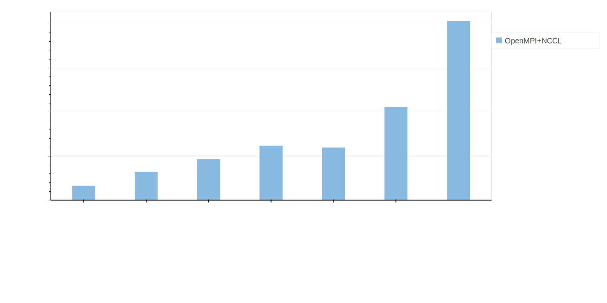
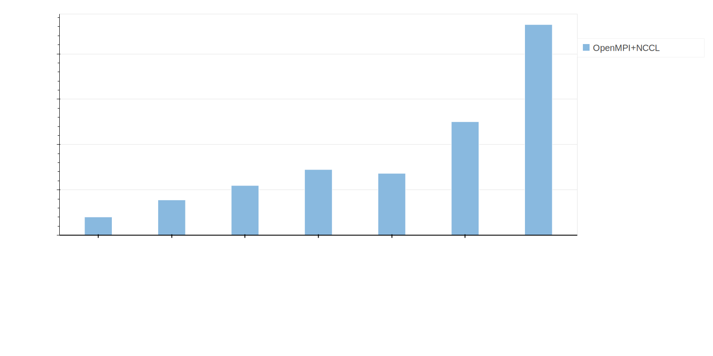

# Batch AI Horovod Benchmark

## ResNet 50
### V100 - ResNet 50

<!-- 
### P100 - ResNet 50

### P40 - ResNet 50

### K80 - ResNet 50

 -->

## ResNet 101
### V100 - ResNet 101

<!-- 
### P100 - ResNet 101

### P40 - ResNet 101

### K80 - ResNet 101

 -->

## ResNet 152
### V100 - ResNet 152

<!-- 
### P100 - ResNet 152

### P40 - ResNet 152

 -->

### Gathering results

Look at the Makefiles in the experiments folder

